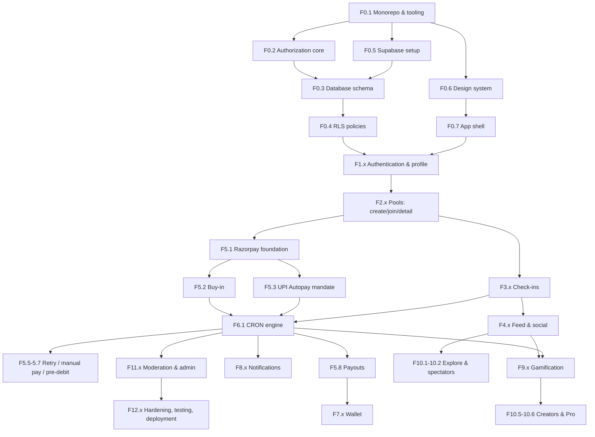

# CONQR — Dependency Graph & Build Order

## Dependency graph

## Build order (serial, one feature at a time)

| # | Feature | Depends on | Why this position |
|---|---------|-----------|-------------------|
| 1 | F0.1 Monorepo & tooling | — | Everything lives here |
| 2 | F0.2 Authorization core | F0.1 | RBAC-first mandate: every later table, screen and function resolves permissions through it |
| 3 | F0.3 Database schema | F0.2 | Schema references authz; Build Bible: "if this is not solid, everything on top is fragile" |
| 4 | F0.4 RLS policies | F0.3 | Ships with schema while context is fresh; blocks any client code touching data |
| 5 | F0.5 Supabase local setup | F0.1 | Lets migrations run + edge functions develop locally |
| 6 | F0.6 Design system | F0.1 | Design-first mandate; all screens consume tokens/components |
| 7 | F0.7 App shell | F0.6 | Navigation + providers that every feature plugs into |
| 8 | F1.1–F1.4 Auth + profile | F0.4, F0.7 | First user-facing flow; unlocks every authenticated feature |
| 9 | F2.1–F2.5 Pools (no money) | F1.x | Core object model; payments stubbed behind interface |
| 10 | F3.1–F3.5 Check-ins | F2.x | Core daily loop |
| 11 | F4.1–F4.6 Feed & social | F3.x | The addictive layer on top of check-ins |
| 12 | F5.1 Razorpay foundation | F2.x | Webhook + customer plumbing before any charge |
| 13 | F5.2–F5.3 Buy-in + mandate | F5.1 | Real join flow (replaces stub) |
| 14 | F6.1 CRON engine core | F5.2–5.3, F3.x | "Ship the CRON first — the payment engine IS the product" |
| 15 | F5.5–F5.7 Retry/manual/pre-debit | F6.1 | Revenue protection + RBI compliance |
| 16 | F2.6 Pool lifecycle CRONs | F6.1 | Activation/cancellation/auto-complete |
| 17 | F5.8–F5.9 Payouts + refunds | F6.1 | Completes the money loop |
| 18 | F7.x Wallet | F5.8 | Now has real data to show |
| 19 | F8.x Notifications | F6.1 | Reminders/warnings ride the CRON |
| 20 | F9.1–F9.3 XP/badges/streak UX | F6.1, F4.x | Dopamine layer |
| 21 | F9.4 Power-ups | F9.1, F5.1 | Purchases + CRON consumption |
| 22 | F10.1–F10.4 Explore/spectator/share | F4.x | Growth layer |
| 23 | F10.5–F10.6 Creators + Pro | F10.1, F5.8 | Revenue layer 2 |
| 24 | F9.5 Seasons | F9.1 | Retention loops |
| 25 | F11.x Moderation & admin | F6.1 | Trust & ops (admin panel needs real flows to administer) |
| 26 | F12.x Hardening/analytics/testing/deploy | all | Continuous, with a dedicated final pass |

Cross-cutting rules applied to every feature: loading/empty/error/success states, skeletons,
transitions, optimistic updates, accessibility, haptics — per the UX standards. RLS + authz
checks land in the same PR as the feature that introduces the surface.
